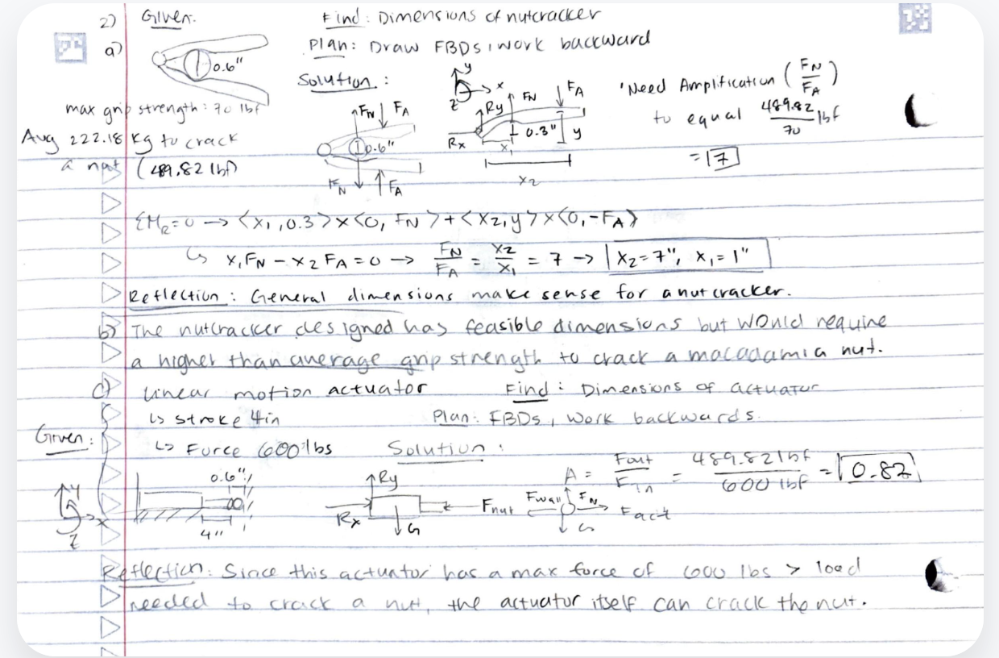

1. Find (The problem statement and objective)
    Problem statement: Design a simple lever nut cracker optimized to crack a  macadamia nut.

2. Given (Constraints and input parameters)
    Size of macadamia nuts: 0.6" diameter
    Maximum grip strength: 70 lbf
    Average load to crack a macadamia nut: 489.82 lbf

3. Approach to problem (Calculations, assumptions, thought process)
    First, I drew out a free body diagram of the simple lever nut cracker containing two applied forces on the handles and two normal forces from the macadamia nut. Then, I defined the dimensions I knew and labeled dimensions I did not know with variables. I exploded the free body diagram into two parts with a pin support at one end. For calculations, I used the sum of moments formula to find the necessary force amplification (fout/fin = 7 based on givens).

4. Diagram of nut cracker design
    This diagram is the image linked.
    

5. Discussion on usability of design
    The design has 1" of space between the pin support and where the macadamia nut contacts the inside of the simple lever; it also has 7" of space between the pin support and where the applied force is most likely. This makes for a realistic nut cracker design (the lever is not too big or small).